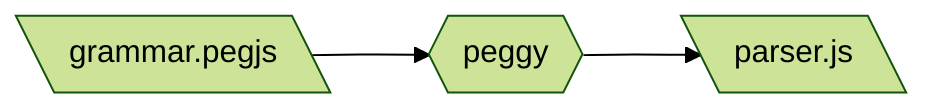

# Hyperscript but it's transpiled experiment 

Rewriting hyperscript (hyperscript.org) from scratch and seeing if I can do it transpiled. This is mostly to learn about language design, not with any near hope of surpassing what hyperscript does.

# Program Flow

When you run `npm run test` right now, what will happen is this:

[PeggyJS](https://peggyjs.org/documentation.html) takes the [PEG](https://en.wikipedia.org/wiki/Parsing_expression_grammar) language grammar file and outputs a JavaScript parser in a new file.

That's it at this point.
