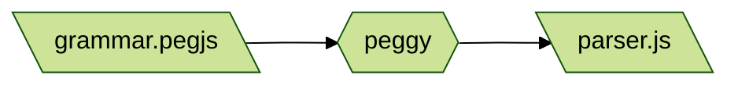
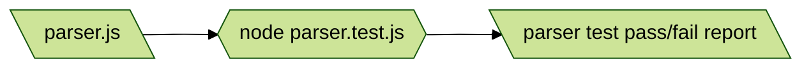
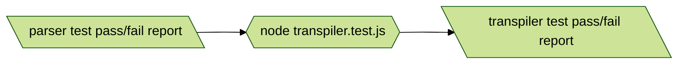

# Hyperscript but it's transpiled experiment 

Rewriting hyperscript (hyperscript.org) from scratch and seeing if I can do it transpiled. This is mostly to learn about language design, not with any near hope of surpassing what hyperscript does.

# Program Flow

When you run `npm run test` right now, what will happen is this:

[PeggyJS](https://peggyjs.org/documentation.html) takes the [PEG](https://en.wikipedia.org/wiki/Parsing_expression_grammar) language grammar file and outputs a JavaScript parser in a new file.



Then it runs a [Node test](https://nodejs.org/docs/latest-v18.x/api/test.html#test-runner) which imports and uses that freshly minted parser JavaScript file. 



And if all of those tests succeed, then it runs more Node tests for the transpiler.



Note: It's much faster if you're working on a specific 
level to only run that test in watch-mode. E.g.

```sh
node --watch --test transpiler.test.js
```


