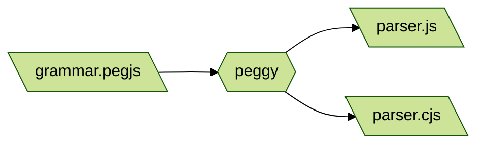
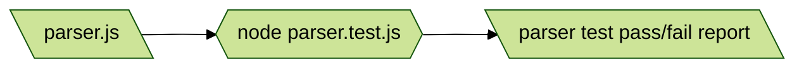
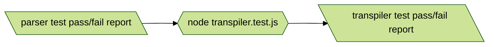
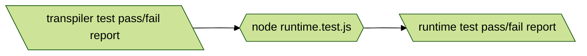

# Hyperscript but it's transpiled experiment 

Rewriting hyperscript (hyperscript.org) from scratch and seeing if I can do it transpiled. This is mostly to learn about language design, not with any near hope of surpassing what hyperscript does.

## HTML

The HTML page demos what is currently working.

To see the HTML page in action, you'll need to serve it. An easy way to do this is

```sh
npx live-server
```

## Test

When you run `npm run test` right now, what will happen is this:

[PeggyJS](https://peggyjs.org/documentation.html) takes the [PEG](https://en.wikipedia.org/wiki/Parsing_expression_grammar) language grammar file and outputs a JavaScript parser in a new file. It then duplicates this parser file with a different name to satisfy both HTML and Node naming requirements.



Then it runs a [Node test](https://nodejs.org/docs/latest-v18.x/api/test.html#test-runner) which imports and uses that freshly minted parser JavaScript file. 



And if all of those tests succeed, then it runs more Node tests for the transpiler.



Note: It's much faster if you're working on a specific 
level to only run that test in watch-mode. E.g.

```sh
node --watch --test transpiler.test.js
```

Then yet more Node tests for the runtime.



## Strategy

My general strategy for adding new features is to start with wishful thinking:

1. write some code which I wish worked in `index.html`
1. see that it doesn't work yet
1. write a failing test in `parser.test.js`,
1. make it pass.
1. commit
1. write a failing test in `transpiler.test.js`,
1. make it pass
1. ammend my commit
1. write a failing test in `runtime.test.js`,
1. make it pass
1. ammend my commit
1. make what I wrote in `index.html` work
1. ensure all the tests still pass
1. ammend my commit  

## Decisions

1. Environment must provide a global object, `____`, which has these functions:
   1. `wait(milliseconds)` returns a promise that resolves after the given number of milliseconds 
   1. `next(start, root, selectorString)` finds the next element after `start` matching the selector under the `root` element

`runtime.install(global)` ensures the `____` exists on the given `global`. You probably want to pass `window`.

`runtime.run(source, element)` runs the hyperscript-ish `source` string on the `element`.
